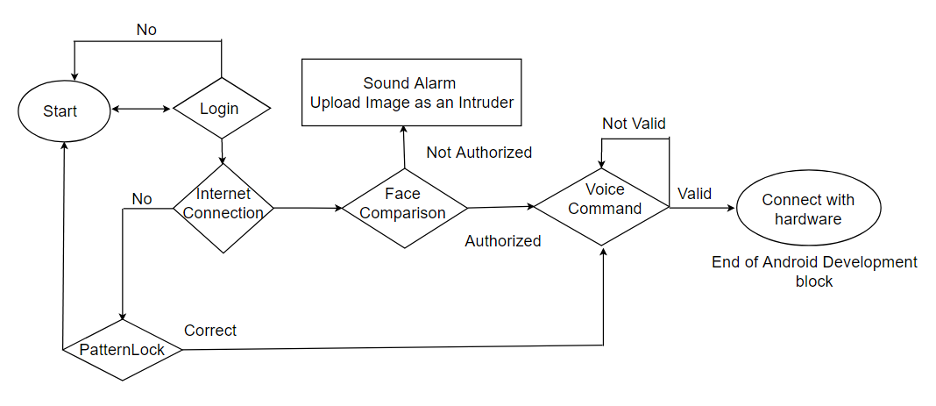
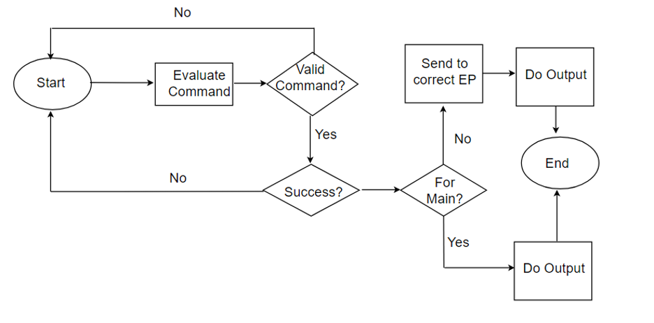
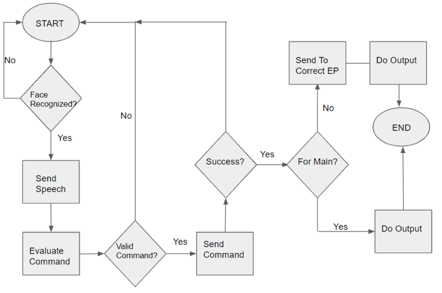
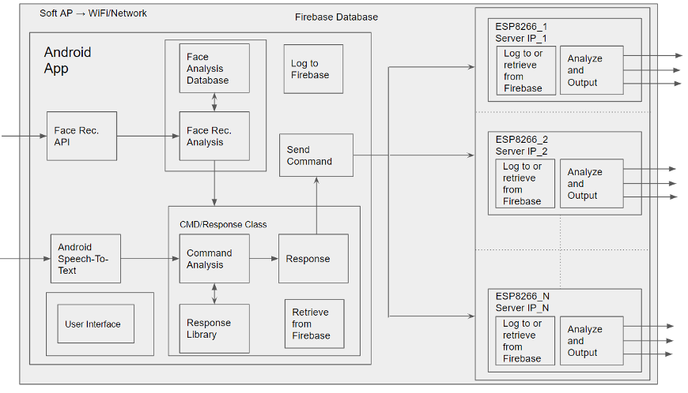

# Front-End Request Internet of Things (FRIOT)

**Institution**: California State Polytechnic University

**Professor**: Dr. Meng-Lai Yin

**Team**: Jinchul Park, Hieu Dang, Kenny Yu, Johnny Castillo, Jim Son

## FRIOT? 

FRIOT 프로젝트는 스마트폰과 WIFI 지원 가능한 마이크로 컨트롤러를 이용하여 소프트웨어와 하드웨어 컨셉 모두를 어우르는 AI기반 모바일 IoT 프로젝트입니다. 

모바일 앱에 구현된 얼굴인식 기능을 통해 유저의 신원을 확인한 후 목소리로 명령하여 가정 내에 있는 조명을 편리하게 켜고 끌 수 있으며 더 나아가 원하는 색상의 LED 조명으로도 바꿔주는 시스템입니다. 

## Procedure

- AWS Facial Rekognition API를 이용해 미리 클라우드에 올려진 팀원들 샘플사진과 앱에서 찍은 사진을 비교해 Similarity 90%가 넘으면 신원 확인이 되도록 설계.
- Google Speech-To-Text API를 이용해 유저의 목소리를 텍스트로 전환, 그리고 그 데이터를 Google Firebase Realtime Database으로 전송하여 마이크로 컨트롤러 (ESP8266)에 전달.
- Arduino C++ 프로그램을 통해 ESP8266 칩이 Google Firebase Realtime Database로 접근하도록 설계.
- 최종적으로 DB에서 받은 데이터를 기반으로 ESP8266과 연결된 조명들이 역할을 수행하도록 설계.

## Design

i. The Flowchat of Android App

ii. The Flowchat of Microcontroller

iii. The Flowchat of Entire System

iV. The Block Diagram

## Presentation and Live Demog

<iframe width="640" height="360" src="https://youtu.be/7liAGbwGvts" frameborder="0" gesture="media" allowfullscreen="" </iframe>

## Technology

- **Languages**: Java, C++
- **Software**: Android Studio, Arduino C++, AWS Facial Rekognition API, Google Speech-To-Text API, Google Firebase Realtime Database
- **Hardware**: Smartphone, ESP8266

